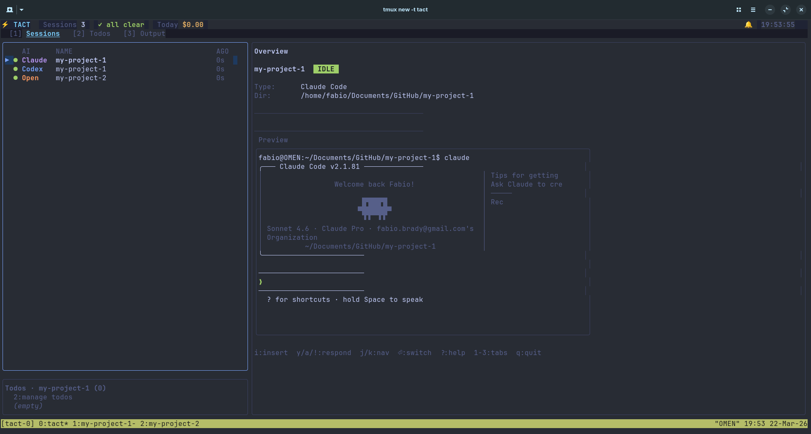

# tact

[](https://golang.org/dl/)
[](LICENSE)
[](https://github.com/Fabio-RibeiroB/tact)

**Tmux AI Control Tower** — A terminal dashboard for monitoring and managing multiple AI coding sessions running in tmux panes.



I wanted to accept/reject my AI assistant's work without leaving one window in tmux.
I also wanted notifications when my input was needed. So I built this.
Just run `tact` in a window within tmux and it will detect other panes/windows running Claude Code or other coding agent.

## Features
- Switch easily between AI coding sessions like Claude Code, Codex, Opencode and Kiro-cli in tmux
- Accept/Reject your agent's work
- Automatically detects session states (idle, working, needs attention, disconnected)
- Monitor token usage and costs for Claude Code sessions
- See context window utilization at a glance
- Get alerts when sessions need attention
- Create and manage project-level todos synced across sessions
- Send inputs to sessions without switching panes

## Installation

### Quick Install

```bash
curl -sSL https://raw.githubusercontent.com/Fabio-RibeiroB/tact/main/go/install.sh | bash
```
### From Source

```bash
git clone https://github.com/Fabio-RibeiroB/tact.git
cd tact/go
make install
```
### Requirements

- Go 1.22 or later
- tmux 3.0+

## Usage

Run tact within any window/pane to auto detect your AI coding sessions.

```bash
tact
```

### Keyboard Shortcuts

| Key | Action |
|-----|--------|
| `j/k` or `↑/↓` | Navigate sessions/todos |
| `Tab` | Switch focus panel |
| `Enter` | Switch to selected pane |
| `r` | Refresh session discovery |
| `n` | Toggle notifications |
| `i` | Enter insert mode (send keys to session) |
| `Esc` | Exit insert mode |
| `q` / `Ctrl+C` | Quit |

#### Session Interaction (when session needs attention)

| Key | Action |
|-----|--------|
| `y` | Confirm/continue (sends Enter) |
| `a` | Auto-approve tool use |
| `!` | Cancel current operation (sends Escape) |

#### Todo Panel

| Key | Action |
|-----|--------|
| `i` | Add new todo |
| `Enter` | Mark todo as done |
| `d` / `x` | Delete todo |
| `Esc` | Exit insert mode |

### CLI Commands

```bash
# Manage todos from command line
tact todo list
tact todo add "Implement feature X" -p myproject -t feature,backend
tact todo done abc12345
tact todo start abc12345
tact todo rm abc12345
```
## Architecture

```
tact/
├── go/
│   ├── cmd/tact/           # CLI entry point
│   ├── internal/
│   │   ├── model/          # Domain types (SessionInfo, TodoItem, etc.)
│   │   ├── parser/         # JSONL parsing, status detection
│   │   ├── tmux/           # Tmux pane discovery and capture
│   │   ├── notify/         # Desktop notifications
│   │   ├── todo/           # Shared todo store with sync
│   │   └── tui/            # Bubble Tea terminal UI
│   ├── go.mod
│   └── Makefile
└── docs/
    └── imgs/               # Screenshots and diagrams
```

### Data Storage

Session data and todos are stored in `~/.local/share/tact/`:
- `sessions/<session-id>.jsonl` — Parsed session data
- `todos/<project-slug>.json` — Project-specific todo lists
## License

This project is licensed under the MIT License - see the [LICENSE](LICENSE) file for details.

## Acknowledgments

- [Bubble Tea](https://github.com/charmbracelet/bubbletea) — Terminal UI framework
- [Lip Gloss](https://github.com/charmbracelet/lipgloss) — Style definitions
- [Cobra](https://github.com/spf13/cobra) — CLI framework
